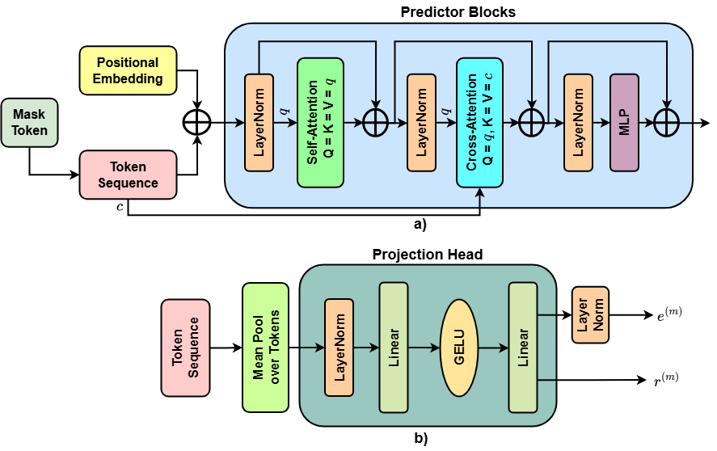

# CR-JEPA: Cross-Modal Joint-Embedding Predictive Learning for Remote Sensing Image Retrieval

[](https://arxiv.org/abs/2606.00706)
[](https://github.com/aminurhossain/CR-JEPA)

**CR-JEPA** (Cross-modal Retrieval Joint-Embedding Predictive Architecture) learns embeddings for same-modal and cross-modal remote sensing image retrieval. Paired observations can differ in imaging physics, resolution, spectral configuration, and appearance. CR-JEPA predicts masked latent targets within and across modalities, regularizes the retrieval space, and uses separate heads for same-modal and cross-modal search.

**Authors:** [Md Aminur Hossain](mailto:md.aminurhossain@gmail.com)<sup>1</sup>, [Ayush V. Patel](mailto:ayu020503@gmail.com)<sup>2</sup>, [Nitant Dube](mailto:nitant@sac.isro.gov.in)<sup>1</sup>, [Biplab Banerjee](mailto:getbiplab@gmail.com)<sup>2</sup>

<sup>1</sup> Space Applications Centre, Indian Space Research Organisation, Ahmedabad, India
<sup>2</sup> Centre of Studies in Resources Engineering, Indian Institute of Technology Bombay, Mumbai, India

**Paper:** <https://arxiv.org/abs/2606.00706> · **Code:** <https://github.com/aminurhossain/CR-JEPA>

## Abstract

Cross-modal remote sensing image retrieval aims to retrieve semantically related scenes across heterogeneous sensing modalities. This remains challenging because paired observations may differ substantially in imaging physics, spatial resolution, spectral configuration, and visual appearance. Moreover, a single retrieval projection trained with one objective may be insufficient to jointly support cross-modal semantic alignment and same-modal neighborhood preservation. We propose CR-JEPA, a Cross-modal Retrieval Joint-Embedding Predictive Architecture tailored to heterogeneous dual-modality remote sensing retrieval. The model uses modality-specific stems, a shared transformer trunk, and JEPA-style predictive objectives to estimate masked latent target features within and across modalities. Inspired by LeJEPA, we apply Sketched Isotropic Gaussian Regularization to raw retrieval projections to stabilize embeddings and mitigate collapse. CR-JEPA further employs a decoupled-head design with a unified retrieval head for same-modal retrieval and a cross-modal retrieval head for cross-modal search. We evaluate CR-JEPA on BEN-14K, CBRSIR_VS, and DSRSID. On BEN-14K, CR-JEPA improves S1→S2 retrieval from 61.23% to 75.82% and S2→S1 retrieval from 63.73% to 75.40% over X-JEPA, while also achieving competitive same-modal retrieval with fewer parameters than X-JEPA.

## Contents

- [Contributions](#contributions)
- [Method](#method)
- [Training setup](#training-setup)
- [Results](#results)
- [Citation](#citation)

## Contributions

- A cross-modal joint-embedding predictive learning framework for heterogeneous dual-modality remote sensing image retrieval.
- A modality-adaptive architecture with modality-specific stems, a shared transformer trunk, and a compact decoupled-head design. Stems handle sensor-dependent inputs, the trunk learns shared scene semantics, and the heads specialize the retrieval spaces.
- Same-modal and cross-modal latent prediction, combined with LeJEPA-style SIGReg on raw retrieval projections, to stabilize embeddings and limit collapse.
- Evaluation on BEN-14K (Sentinel-1/Sentinel-2), CBRSIR_VS (RGB optical/SAR), and DSRSID (panchromatic/multispectral), under same-modal and cross-modal protocols.

Labels define relevance at evaluation time. The training objective is self-supervised and does not use them.

## Method

CR-JEPA takes a paired observation \((x^{(a)}, x^{(b)})\). Each modality passes through its own stem, then a shared transformer trunk. Predictive heads forecast masked latent tokens inside a modality and across modalities. Two retrieval heads produce the embeddings used at search time. SIGReg regularizes the raw projections before \(\ell_2\) normalization.


### Problem

A dataset is a set of paired views and semantic annotations,

\[
\mathcal{D}=\{(x_i^{(a)}, x_i^{(b)}, y_i)\}_{i=1}^{N}.
\]

The modality pair depends on the benchmark: Sentinel-1 and Sentinel-2 on BEN-14K, optical and SAR on CBRSIR_VS, and panchromatic and multispectral on DSRSID. Retrieval is evaluated in four directions,

\[
a \rightarrow a, \quad b \rightarrow b, \quad a \rightarrow b, \quad b \rightarrow a.
\]

The first two are same-modal. The last two are cross-modal. On BEN-14K, a retrieved image is relevant when its multi-label set overlaps the query. On CBRSIR_VS and DSRSID, relevance is class equality.

### Stems, trunk, and predictors

For modality \(m \in \{a, b\}\), the stem maps the image to patch tokens \(h^{(m)} = f_m(x^{(m)})\), and the shared trunk maps those tokens to \(z^{(m)} = g(h^{(m)})\). Tokens are split into visible context \(V^{(m)}\) and masked targets \(M^{(m)}\). The default mask ratio is \(0.5\). The model predicts masked tokens in feature space.

Two same-modal predictors and one shared cross-modal predictor are query-based: learnable mask queries, target-position embeddings, self-attention, cross-attention to the visible context, and an MLP. The predictive loss is a weighted sum of squared errors on the four routes \(a \rightarrow a\), \(b \rightarrow b\), \(a \rightarrow b\), and \(b \rightarrow a\).



### Decoupled retrieval heads

Visible tokens are mean-pooled. A unified head \(\phi_{\mathrm{uni}}\) embeds that vector for same-modal retrieval. A cross-modal head \(\phi_{\mathrm{cross}}\) embeds it for cross-modal search. Each head returns a raw projection \(r\) and an \(\ell_2\)-normalized embedding \(e\).

The cross-modal loss is symmetric batch InfoNCE between the two modalities in the cross-modal space. The unified loss is InfoNCE plus a direct cosine alignment term on paired samples, so the same-modal head learns a modality-consistent semantic space. Within-modality structure is carried by the same-modal predictive routes and the shared trunk.

### SIGReg and the full objective

Sketched Isotropic Gaussian Regularization (SIGReg), following LeJEPA, is applied to the four raw projections \(r_{\mathrm{cross}}^{(a)}\), \(r_{\mathrm{cross}}^{(b)}\), \(r_{\mathrm{uni}}^{(a)}\), and \(r_{\mathrm{uni}}^{(b)}\) before normalization. Random one-dimensional sketches are matched to a standard Gaussian through the empirical characteristic function.

\[
\mathcal{L}
=
\mathcal{L}_{\mathrm{pred}}
+
\mathcal{L}_{\mathrm{retr}}
+
\lambda_{\mathrm{sigreg}}\mathcal{L}_{\mathrm{sigreg}},
\qquad
\mathcal{L}_{\mathrm{retr}}
=
\lambda_{\mathrm{cross}}\mathcal{L}_{\mathrm{cross}}
+
\lambda_{\mathrm{uni}}\mathcal{L}_{\mathrm{uni}}.
\]

### Inference

Each image is encoded by its stem and the shared trunk, then projected by the head for that search direction. Same-modal retrieval uses \(e_{\mathrm{uni}}\). Cross-modal retrieval uses \(e_{\mathrm{cross}}\). Ranking uses cosine similarity. When the query and gallery share an index, the trivial self-match is removed.

## Training setup

The same backbone, predictor, and retrieval-head configuration is used on all three datasets. Only the stem input channels change.

| Item | Setting |
|---|---|
| Input | \(224 \times 224\), patch size 16 |
| Channels | BEN-14K: S1 = 2, S2 = 12. CBRSIR_VS: RGB and SAR intensity. DSRSID: PAN = 1, MS = 4 |
| Model | Embedding 512, 8 heads, trunk depth 12, predictor depth 6, retrieval dimension 256, mask ratio 0.5 |
| Optimizer | AdamW, weight decay 0.04, gradient clip 1.0, automatic mixed precision |
| Schedule | Learning rate \(10^{-4} \rightarrow 10^{-3} \rightarrow 10^{-6}\), cosine decay, 15 warmup epochs, 400 epochs |
| Batch | Train 512, evaluate 256, on NVIDIA A100 80 GB GPUs |
| Size | 117.93M trainable parameters, about 9.6 GFLOPs per image, 17 ms average latency |

## Results

Bold is the best score in a comparison. Underlined is second best. The BEN-14K table is the benchmark run used for comparison with published baselines.

### BEN-14K

Multi-label retrieval. Metric is F1@5 (%). Published baselines follow the X-JEPA protocol.

| Method | Params (M) | S1→S1 | S2→S2 | S1→S2 | S2→S1 |
|---|---:|---:|---:|---:|---:|
| MAE | 224.87 | 60.81 | 72.04 | 41.78 | 46.12 |
| MAE-RVSA | 227.75 | 55.40 | 71.47 | 36.66 | 38.05 |
| SatMAE | 329.40 | 70.86 | 78.71 | 49.57 | 52.48 |
| SatMAE++ | 329.14 | 67.29 | 76.48 | 50.21 | 54.98 |
| ScaleMAE | 284.35 | 62.73 | — | — | — |
| CrossMAE | 250.57 | 66.45 | 71.28 | 49.46 | 48.71 |
| CSMAE-SESD (Disjoint) | 210.64 | 70.62 | 39.01 | 38.74 | 38.42 |
| SkySense | 398.04 | 69.87 | 73.42 | 50.26 | 52.11 |
| CROMA | 310.54 | 68.48 | 72.71 | 46.53 | 48.61 |
| DeCUR | 250.54 | 71.26 | 75.36 | 40.78 | 41.83 |
| REJEPA | 197.09 | **76.38** | 75.42 | 55.46 | 56.32 |
| X-JEPA | 172.86 | 72.98 | <u>82.65</u> | <u>61.23</u> | <u>63.73</u> |
| **CR-JEPA** | **117.93** | <u>75.11</u> | **82.87** | **75.82** | **75.40** |

Relative to X-JEPA, the cross-modal gains are 14.59 F1@5 on S1→S2 and 11.67 on S2→S1, with 117.93M parameters against 172.86M, 9.6 GFLOPs against 10.8, and 17 ms against 20 ms.

Across five seeds, CR-JEPA scores \(75.51 \pm 0.32\), \(82.89 \pm 0.13\), \(75.78 \pm 0.54\), and \(75.46 \pm 0.51\) F1@5 on S1→S1, S2→S2, S1→S2, and S2→S1.

### CBRSIR_VS and DSRSID

Single-label retrieval. Metrics are global mAP and P@5. MAE, SatMAE++, REJEPA, and X-JEPA were run under the same splits, preprocessing, resolution, schedule, directions, and metrics as CR-JEPA.

**CBRSIR_VS** (RGB optical / SAR, 10 classes, 26,901 pairs):

| Method | RGB→RGB mAP / P@5 | SAR→SAR mAP / P@5 | RGB→SAR mAP / P@5 | SAR→RGB mAP / P@5 |
|---|---:|---:|---:|---:|
| MAE | 71.47 / 76.92 | 48.53 / 52.88 | 51.15 / 55.42 | 53.37 / 58.19 |
| SatMAE++ | 74.76 / 80.14 | 57.65 / 62.27 | 60.41 / 64.73 | 61.18 / 66.59 |
| REJEPA | 75.74 / 81.45 | 63.21 / 67.92 | 66.88 / 70.88 | 64.95 / 70.73 |
| X-JEPA | <u>79.12 / 85.19</u> | <u>67.34 / 70.78</u> | <u>70.11 / 74.41</u> | <u>67.87 / 73.41</u> |
| **CR-JEPA** | **86.94 / 90.94** | **71.88 / 76.21** | **72.62 / 78.11** | **73.55 / 78.41** |

**DSRSID** (panchromatic / multispectral, 8 classes, 80,000 pairs):

| Method | PAN→PAN mAP / P@5 | MS→MS mAP / P@5 | PAN→MS mAP / P@5 | MS→PAN mAP / P@5 |
|---|---:|---:|---:|---:|
| MAE | 55.23 / 59.08 | 58.46 / 61.75 | 52.12 / 57.19 | 55.54 / 59.41 |
| SatMAE++ | 60.07 / 64.24 | 64.15 / 68.04 | 59.33 / 64.82 | 63.16 / 67.29 |
| REJEPA | 62.42 / 66.18 | 65.76 / 69.35 | 62.21 / 67.62 | 65.84 / 69.37 |
| X-JEPA | <u>64.65 / 68.42</u> | <u>72.13 / 76.08</u> | <u>66.36 / 70.74</u> | <u>68.82 / 72.91</u> |
| **CR-JEPA** | **69.82 / 77.81** | **73.10 / 79.13** | **72.15 / 77.27** | **71.24 / 78.43** |

### Ablation on BEN-14K

Component ablation, F1@5. The full model has the highest average, 77.30.

| Variant | S1→S1 | S2→S2 | S1→S2 | S2→S1 | Avg. |
|---|---:|---:|---:|---:|---:|
| \(\mathcal{L}_{\mathrm{pred}}+\mathcal{L}_{\mathrm{uni}}\) | 74.44 | 77.68 | 75.38 | 74.79 | 75.57 |
| Without SIGReg | 74.53 | 77.89 | 74.32 | 75.01 | 75.44 |
| Best partial predictive routing | **75.67** | <u>80.92</u> | **76.13** | <u>75.18</u> | <u>76.98</u> |
| Fully independent predictors | 74.97 | 78.42 | 75.72 | 74.63 | 75.94 |
| Three-head + \(\mathcal{L}_{\mathrm{same}}\) | 74.02 | 76.11 | 75.03 | 74.92 | 75.02 |
| Single retrieval head | 58.51 | 68.71 | 32.43 | 49.63 | 52.32 |
| Dual-encoder variant | 70.34 | 75.80 | 67.34 | 71.68 | 71.29 |
| **CR-JEPA** | <u>75.11</u> | **82.87** | <u>75.82</u> | **75.40** | **77.30** |

The supplementary material reports loss-term combinations, predictor routing and sharing, mask-ratio and predictor-depth sweeps, and the dual-encoder comparison (154.77M parameters, average F1@5 71.29). Training assumes paired heterogeneous observations. Partially paired, unpaired, and cross-dataset settings are left for future work.

## Citation

```bibtex
@article{hossain2026crjepa,
  title   = {CR-JEPA: Cross-Modal Joint-Embedding Predictive Learning for Remote Sensing Image Retrieval},
  author  = {Hossain, Md Aminur and Patel, Ayush V. and Dube, Nitant and Banerjee, Biplab},
  journal = {arXiv preprint arXiv:2606.00706},
  year    = {2026},
  url     = {https://arxiv.org/abs/2606.00706}
}
```

## Acknowledgments

This work was supported by the IIT Bombay–ISRO Space Technology Cell (STC) under project RD/0126-ISROC00-006 and by the Space Applications Centre (SAC), ISRO.

The evaluation uses BigEarthNet-MM / BEN-14K, CBRSIR_VS, and DSRSID. Related methods include [X-JEPA](https://openaccess.thecvf.com/content/WACV2026/papers/Choudhury_X-JEPA_A_Novel_Joint_Learning_Cross-Modal_Predictive_Alignment_Framework_for_WACV_2026_paper.pdf) (WACV 2026), REJEPA (CVPR Workshops 2025), and [LeJEPA](https://arxiv.org/abs/2511.08544).
